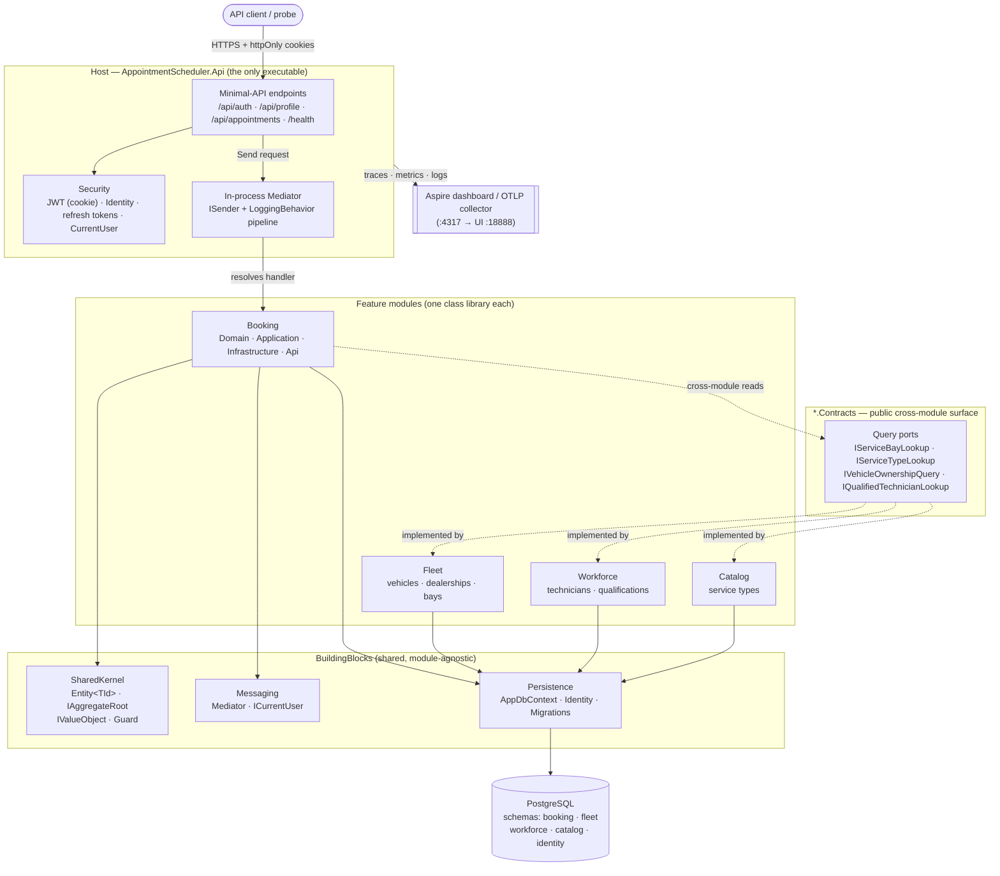
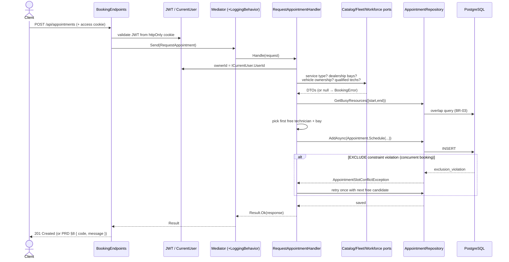

# System Design — Vehicle Service Scheduler

A backend .NET service for scheduling vehicle service appointments across dealerships, technicians,
and service bays. It is a **modular monolith** built with **Clean Architecture** and **vertical-slice
CQRS**, deployed as a single process but internally partitioned into feature modules that are
designed to be extracted into independent services without a rewrite. There is no frontend — the API
is the product, and the OpenAPI document at `/openapi/v1.json` is the client contract.

This document covers the architecture, each component's role, the request/data flow, the technology
choices and their justifications, the observability strategy, and how generative AI was used during
design. It complements the [ADRs](adrs/) (which record the *decisions*) by describing the *system as
built*.

---

## 1. Architecture diagram



**Reference-graph rule (compiler-enforced):** `BuildingBlocks*` ← `*.Contracts` ← `<Module>` ←
`Host`. A module references its own `Contracts`, the `BuildingBlocks`, and *other modules' `Contracts`
only* — never another module's implementation. A [NetArchTest](../tests/AppointmentScheduler.ArchitectureTests)
suite fails the build if that boundary is crossed.

---

## 2. Component roles

| Component | Project | Role |
|---|---|---|
| **Host / API** | `Host/AppointmentScheduler.Api` | The single deployable process. Owns `Program.cs`, composition root (`Add<Module>Module()`), security wiring, health checks, OpenAPI, and DB initialization. Endpoints are thin: bind → `ISender.Send(...)` → map result to HTTP. |
| **Booking module** | `Modules/Booking` | Core domain: the `Appointment` aggregate — a confirmed reservation of a bay + technician for a vehicle over a `TimeSlot`. Owns the booking workflow, availability logic, and the no-double-booking guarantee. The only module with its own `Api/` endpoints. |
| **Fleet module** | `Modules/Fleet` | Vehicles, dealerships, and service bays. Provides `IServiceBayLookup` (bays per dealership) and `IVehicleOwnershipQuery` (does this caller own this vehicle?). |
| **Workforce module** | `Modules/Workforce` | Technicians and their skill qualifications. Provides `IQualifiedTechnicianLookup` (technicians qualified for a service type at a dealership). |
| **Catalog module** | `Modules/Catalog` | Service types and their fixed durations. Provides `IServiceTypeLookup` — the authoritative source of appointment duration (BR-07). |
| **`*.Contracts`** | per module | Each module's public surface for other modules: cross-module query ports + DTOs (and, later, published events). Consumers depend on this, never on the implementation. |
| **BuildingBlocks.SharedKernel** | `BuildingBlocks/…SharedKernel` | Tactical-DDD primitives: `Entity<TId>` (identity equality), `IAggregateRoot` / `IValueObject` markers, and `Guard` argument helpers. No framework dependencies. |
| **BuildingBlocks (Messaging)** | `BuildingBlocks/…BuildingBlocks` | The lightweight in-process **mediator** (`ISender`, `IRequestHandler<,>`, `IPipelineBehavior<,>`) and cross-cutting ports (`ICurrentUser`). No MediatR. |
| **BuildingBlocks.Persistence** | `BuildingBlocks/…Persistence` | The single shared `AppDbContext` (also the Identity store), ASP.NET Core Identity, refresh-token storage/rotation, and all EF Core migrations. References **no module** — *module* aggregates are reached via `Set<T>()` and each module contributes its `IEntityTypeConfiguration<>`. Persistence itself owns the Identity tables and `refresh_tokens`, which the context exposes directly (e.g. `DbSet<RefreshToken>`). |
| **PostgreSQL** | — | System of record. One schema per module (`booking` / `fleet` / `workforce` / `catalog`) plus Identity tables. Enforces the no-overlap invariant with `EXCLUDE` constraints. |

---

## 3. Data flow

### Request pipeline (write path — "book an appointment")



Step by step:

1. **Transport & auth.** The client calls `POST /api/appointments` with the access token riding
   **primarily in an `httpOnly` cookie** (never JS-readable). `JwtBearerEvents.OnMessageReceived`
   lifts the token from the cookie first, and falls back to the `Authorization: Bearer` header if
   the cookie is absent (useful for service-to-service and probe traffic). The token is
   HS256-validated with a pinned `ValidAlgorithms` list plus issuer, audience, lifetime, and signing
   key.
2. **Endpoint.** `BookingEndpoints` binds the request body directly to the Application request record
   (`RequestAppointment` — *no* owner field) and calls `ISender.Send(...)`. Endpoints contain no
   business logic.
3. **Mediator pipeline.** The mediator resolves the single handler and wraps it with `LoggingBehavior`,
   which times every request and logs success/failure with the elapsed milliseconds.
4. **Handler (vertical slice).** `RequestAppointmentHandler` takes the owner from `ICurrentUser`
   (server-side, never the body), then validates in PRD §10 order via the **cross-module query ports** —
   service type exists, start is in the future, dealership exists, caller owns the vehicle, qualified
   technicians exist. Each failure maps to a `BookingError` carrying a stable code + HTTP status.
5. **Availability.** It reads currently-busy bays/technicians for `[start, end)` using the shared
   half-open overlap predicate (BR-03), narrows to free candidates, and constructs the `Appointment`
   aggregate — whose factory re-enforces the invariants and derives the window as `[start, start + duration)`.
6. **Concurrency safety.** The insert can still race a concurrent booking. The database — not the
   application — is the arbiter: Postgres `EXCLUDE` constraints reject an overlapping bay/technician,
   surfacing as `AppointmentSlotConflictException`. The handler **retries at most once** with the
   next free candidate in the losing dimension; if that retry also loses (or no free candidate
   remains), the caller receives `409 slot_conflict` per PRD §8. Retry is **bounded to one** — not a
   loop — to prevent unbounded contention under load (ADR-0005 / PRD §10).
7. **Response.** Success → `201 Created` with the appointment DTO. Failure → the `BookingError`'s
   `{ code, message }` at its HTTP status (the PRD §8 error contract).

### Cross-module reads

Booking never touches another module's tables or types. It calls a **query port owned by the
provider** (e.g. `IServiceBayLookup` in `Fleet.Contracts`), which the provider implements in its own
Infrastructure over the shared `AppDbContext`. This keeps module boundaries intact today and makes the
seam a network call away tomorrow. Cross-module **writes** are designed to travel as domain events
(ADR-0002) rather than direct calls — see *Roadmap* below.

### Persistence

All modules share one `AppDbContext` that references no module. Each *module* aggregate is mapped by
the owning module's `IEntityTypeConfiguration<>` into that module's Postgres schema, with snake_case
columns; access is via `Set<T>()`, so the context stays module-agnostic. Persistence itself owns the
ASP.NET Core Identity tables and the `refresh_tokens` table — those live directly on the context
(`DbSet<RefreshToken>` + `IdentityDbContext<AppUser>`) since they belong to the platform, not to any
feature module. Schema changes are owned by EF Core migrations; Development auto-migrates and seeds
on startup, production runs migrations as a deliberate deploy step.

---

## 4. Technology choices & justifications

| Choice | Why | Reference |
|---|---|---|
| **.NET 10 / C# 14** | Modern LTS-track runtime; records, minimal APIs, and `TimeProvider` make the DDD + testable-time style concise. Common properties are centralized in `Directory.Build.props`, warnings-as-errors on. | — |
| **Modular monolith** (not microservices) | One deployable to operate, test, and debug, while still enforcing hard internal boundaries. Modules are extraction-ready, so we get microservice *design discipline* without the distributed-systems *tax* prematurely. | [ADR-0001](adrs/0001-modular-monolith.md) |
| **Project-per-module** | Boundaries become a **compile error**, not a convention — a module physically cannot reference another module's internals. Backed by NetArchTest as a runtime backstop. | [ADR-0006](adrs/0006-project-per-module-physical-structure.md) |
| **PostgreSQL** (over a document DB) | The core invariant is *no overlapping bookings for a bay/technician* — a multi-row, concurrent constraint. Postgres enforces it declaratively with `EXCLUDE … USING gist` (with `btree_gist`), which a document store cannot. Relational integrity + transactions fit the domain. | [ADR-0005](adrs/0005-postgresql-over-document-database.md) |
| **EF Core 10 + Npgsql** | Productive mapping with `IEntityTypeConfiguration` per aggregate, LINQ overlap queries that translate to SQL, and first-class migrations. Schema-per-module keeps ownership explicit. | — |
| **Vertical-slice CQRS + tiny in-process mediator** | Each feature is one self-contained request/handler file; the mediator adds cross-cutting behavior (logging, and later validation/metrics) without a heavyweight dependency. No MediatR keeps the surface small and licensing-free. | — |
| **FluentResults** | Business failures (`BookingError`) are values carrying a stable machine code + HTTP status — no exceptions for expected outcomes, and the endpoint needs no code→status mapping table. | — |
| **JWT in httpOnly cookies + ASP.NET Core Identity** | Cookie transport is XSS-safe (tokens unreadable by JS) and, with `SameSite=Strict`, CSRF-safe without a separate token. Short-lived access token (15 min default) + rotating, reuse-detecting refresh token (**configured TTL, defaulting to 7 days from original login — not reset on rotation**). Identity gives a battle-tested user store, PBKDF2 hashing, RBAC, and lockout. | [authentication.md](authentication.md) |
| **OpenTelemetry** | Vendor-neutral traces, metrics, and logs over OTLP — swap the backend (Aspire dashboard, Jaeger, Tempo, Prometheus, a SaaS) without code changes. | §5 |
| **xUnit + AwesomeAssertions + NetArchTest** | Unit tests for handlers, `WebApplicationFactory` integration tests over real HTTP, and architecture tests that make the design rules self-verifying. | [../tests](../tests) |

---

## 5. Observability strategy

Observability is wired in `Program.cs` and follows the three pillars, plus health probes.

**Tracing.** OpenTelemetry with ASP.NET Core and `HttpClient` instrumentation, exported via **OTLP**
(honours the standard `OTEL_EXPORTER_OTLP_*` env vars; endpoint defaults to `localhost:4317`). Every
inbound request becomes a span; outbound calls (e.g. to a future extracted module) are child spans, so
a request is traceable end-to-end. The resource is tagged with service name + assembly version.

**Metrics.** OpenTelemetry metrics from ASP.NET Core (request rate, duration, active requests),
`HttpClient`, and the **.NET runtime** (GC, thread pool, allocations), exported over the same OTLP
pipeline. This gives RED-style service metrics and runtime health with no bespoke instrumentation.

**Logging.** `ILogger` with **trace-context correlation**: `ActivityTrackingOptions.TraceId | SpanId`
stamps every log line with the active trace/span id, so logs join up with traces. Logs are **also
exported via OTLP** (`WithLogging`, sharing the same resource as traces/metrics), so a backend can show
a trace and its own log records together. In parallel, Development keeps the human-readable console and
other environments emit **structured JSON** (`AddJsonConsole`, scopes included) for log aggregators. The
mediator's `LoggingBehavior` logs every request name and its elapsed time (and exceptions with
duration) — one consistent place for per-request timing across all slices.

**Local viewing.** `docker-compose.yml` runs a **.NET Aspire dashboard** whose OTLP receiver is mapped
to `localhost:4317`, so `docker compose up -d` + running the API surfaces all three signals — correlated
— at `http://localhost:18888`, with no app configuration.

**Health checks.** Kubernetes-style split:
- `GET /health/live` — liveness, no dependency checks (is the process up?).
- `GET /health/ready` — readiness, pings the database via `AddDbContextCheck` (can we serve traffic?).
- `GET /health` — liveness alias for existing probes.

**What to add next:** a metrics/validation pipeline behavior for domain-level counters (e.g. bookings
by outcome code), and business KPIs (conflict-retry rate, no-availability rate) exposed as OTel
metrics.

---

## 6. How generative AI assisted the design phase

GenAI (Claude) was used as a **design collaborator and reviewer**, with the human as the decision-maker
and automated checks as the objective backstop. Concretely:

- **Decision framing → ADRs.** For each significant fork (monolith vs microservices, relational vs
  document store, project-per-module physical layout, events for inter-module comms), the AI drafted
  the option space, trade-offs, and consequences, which were then edited and committed as the
  [ADRs](adrs/). The AI accelerated *articulating* the rationale; the *choices* were human-owned.
- **Domain modeling.** It helped shape the tactical-DDD vocabulary — where the aggregate boundary sits
  (`Appointment` as the scheduling source of truth, [ADR-0003](adrs/0003-appointment-as-scheduling-source-of-truth.md)),
  which types are entities vs value objects (`TimeSlot`, `Vin`), and how to express invariants as
  factory guards rather than anemic setters.
- **Concurrency design.** The "read availability, then let the database arbitrate via `EXCLUDE`
  constraints, then retry once" strategy was refined in dialogue — surfacing the race between the
  availability read and the insert, and settling on a DB-enforced invariant over application-level
  locking.
- **Boundary enforcement made executable.** Rather than trusting conventions, the AI helped author the
  **NetArchTest** suite and the reference-graph rules so the architecture's boundaries *fail the build*
  when violated — turning design intent into a regression test.
- **Scaffolding & consistency sweeps.** Repetitive, error-prone work (per-module EF configurations,
  endpoint wiring, guard-clause consolidation into a shared `Guard` helper, hoisting common MSBuild
  properties) was drafted by the AI and verified by `dotnet build` (0 warnings) + the full test suite.
- **Review, not just generation.** The AI performed structured code review — surfacing duplicated
  guard clauses (consolidated into a shared `Guard` helper), an unclassified domain type, and
  documentation that described an events/outbox system not yet implemented — which fed directly back
  into the roadmap.

**Guardrails.** AI output was treated as a *proposal*, never authority. Every change was gated by the
compiler, warnings-as-errors, the architecture tests, and the unit/integration suites; ADRs preserve
the human reasoning so the "why" survives independent of the tool. Where docs and code diverged
(events/outbox), that gap is called out honestly rather than papered over.

---

## Roadmap / known gaps

- **Events & outbox (ADR-0002) are designed but not yet implemented** — no `IEventPublisher` or
  outbox dispatcher exists in code today. Cross-module *writes* currently have no path; only cross-module
  *reads* (query ports) are live. This is the next major building block. Concrete motivating cases
  already visible: Fleet needs `AppointmentConfirmed` to update bay utilization and free-slot views;
  Workforce needs it to notify the assigned technician and reflect the assignment on their schedule;
  a future Notifications module needs it to email/SMS the customer. Today, none of those reactions
  have a channel — the only ways to add them would be a direct cross-module call (banned by the
  reference-graph rule) or the customer polling the API. That gap is what the outbox unblocks.
- Appointment **lifecycle** is `Confirmed`-only; cancellation/rescheduling are future work.
```
