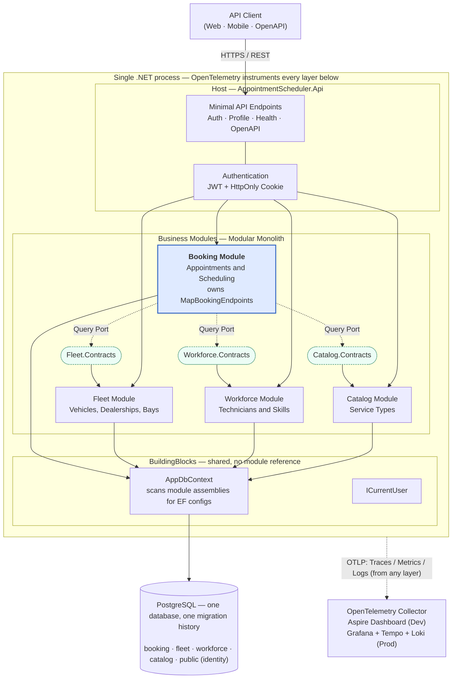

# High-Level System Architecture

One-page overview of the Vehicle Service Scheduler — read this first if you're
new to the codebase or briefing a non-engineering stakeholder. For the deeper
"as-built" walkthrough see [DESIGN.md](../DESIGN.md); for the recorded
decisions behind this shape see the [ADRs](../adrs/).

## How to read the diagram

- **Solid arrows** are runtime calls (HTTP, DI resolution, DbContext access).
- **Dashed arrows** are cross-module references that go **only through
  `.Contracts` projects** — the compile-time boundary that
  [ADR-0001](../adrs/0001-modular-monolith.md) enforces and
  [ArchitectureTests](../../tests/AppointmentScheduler.ArchitectureTests/ModuleBoundaryTests.cs)
  proves.
- **Booking is highlighted** because it is today the only module with HTTP
  endpoints (`MapBookingEndpoints` lives inside the module, not in Host). The
  other three modules are read-only providers today.

## Key properties

| | |
|---|---|
| **Deployment** | Single .NET process, stateless — scale horizontally behind a load balancer. |
| **Persistence** | One PostgreSQL database. Each module owns its own schema (`booking.*`, `fleet.*`, `workforce.*`, `catalog.*`); Identity lives in `public.*`. Table ownership is explicit in the database itself. |
| **Cross-module reads** | Through provider-owned ports in `<Module>.Contracts` (e.g. `IServiceBayLookup` in `Fleet.Contracts`). Never through another module's `DbContext` or repository. |
| **Cross-module writes** | Not present today. When added, will use events per [ADR-0002](../adrs/0002-events-for-inter-module-communication.md). |
| **Auth** | JWT in `httpOnly` cookie (XSS-safe) + `SameSite=Strict` (CSRF-safe). Access token 15 min, refresh token 7 days, rotation-with-reuse-detection. |
| **Observability** | OpenTelemetry OTLP for traces + metrics; JSON console logs. Collector target is per-environment. |
| **Extraction to microservices** | Copy `src/Modules/<Module>/` to a new repo, add a new host, swap in-process contract implementations for HTTP/gRPC clients, split the module's schema out via `pg_dump`. See [ADR-0004](../adrs/0004-inter-service-communication-strategy.md) and [ADR-0006](../adrs/0006-project-per-module-physical-structure.md). |

## Related documents

- [DESIGN.md](../DESIGN.md) — deeper "as-built" walkthrough with request-flow and technology choices
- [authentication.md](../authentication.md) — auth design spec
- [database.md](../database.md) — schema and migration details
- [adrs/](../adrs/) — recorded architectural decisions
