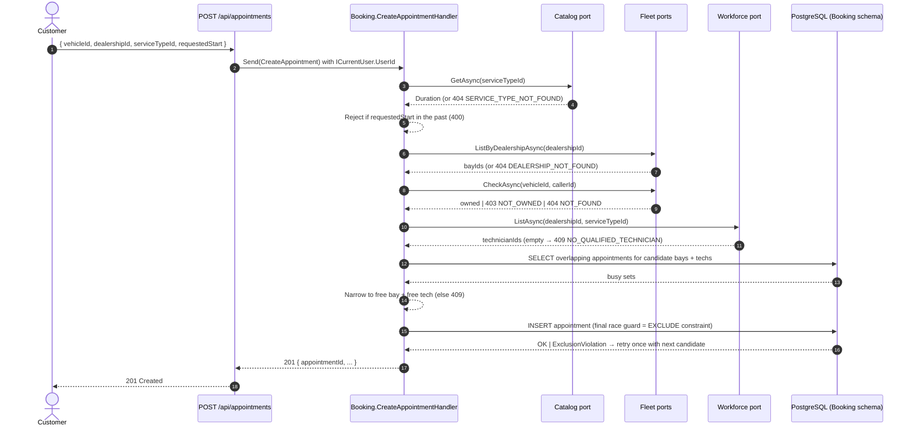

# PRD: Unified Service Scheduler — Appointment Booking

> _No issue yet — this file will be renamed to `<issue-number>-appointment-booking.md` and back-linked once one is created._

## Problem Statement

Dealership staff currently book vehicle service appointments manually — by phone, spreadsheet, or
whiteboard — checking service bay and technician availability by hand. The process is slow,
error-prone, and produces double-bookings when two staff members schedule against the same bay or
technician at overlapping times. Customers have no self-service way to request an appointment and
get an immediate, reliable confirmation that a bay and a qualified technician are actually
available for the full duration of the service.

## Solution

A single backend endpoint lets an authenticated customer request an appointment for one of their
vehicles at a chosen dealership and service type at a desired start time. The system atomically
checks bay + qualified-technician availability at that dealership for the full service duration
and, if both exist, persists a confirmed `Appointment` linking customer, vehicle, dealership,
bay, and technician. If no combination is available, the request is rejected with a
machine-readable reason.

This is the first vertical slice built on the modular-monolith skeleton described in
[ADR-0001](../adrs/0001-modular-monolith.md) and
[ADR-0002](../adrs/0002-events-for-inter-module-communication.md). It stands up the **Booking**,
**Fleet**, **Workforce**, and **Catalog** modules.

## 1. Assumptions

| ID | Assumption |
|---|---|
| AS-01 | Customer authentication is provided by the existing JWT + cookie stack. The caller's user id is resolved from `ICurrentUser` — never taken from the request body. |
| AS-02 | Vehicle ownership is maintained by the Fleet module (`Vehicle.OwnerId` → `AppUser.Id`). This slice consumes ownership; it does not model a separate `Customer` aggregate. |
| AS-03 | A technician's calendar consists only of confirmed appointments in this system. External schedule sources (vacation, PTO, other systems) are out of scope. |
| AS-04 | Service duration is fixed per `ServiceType`. Variable-duration jobs are out of scope. |
| AS-05 | All times are stored and processed in UTC end-to-end. Time-zone conversion for display is a client concern. |

## 2. User Stories

**Customer:**

| ID | Story |
|---|---|
| US-01 | As a customer, I want to request a service appointment for a vehicle at a dealership at a desired start time, so that I don't have to phone the dealership to book. |
| US-02 | As a customer, I want the system to auto-assign an available service bay, so that I don't need to know which bays exist. |
| US-03 | As a customer, I want the system to auto-assign a qualified technician, so that I don't need to know who works there. |
| US-04 | As a customer, I want a confirmed appointment record with the assigned bay, technician, start, and end, so that I know exactly what was booked. |
| US-05 | As a customer, I want a clear, machine-readable failure reason when the request cannot be fulfilled, so that I can retry or adjust. |
| US-06 | As a customer with multiple vehicles, I want each booking to apply to exactly the vehicle I specify, so that I can manage per-vehicle service history. |
| US-07 | As a customer, I want to book at any dealership (not just a home dealership), so that I can get service wherever I currently am. |

**Dealership:**

| ID | Story |
|---|---|
| US-08 | As a dealership, I want the same technician never assigned to overlapping appointments, so that no technician is expected in two places at once. |
| US-09 | As a dealership, I want the same service bay never assigned to overlapping appointments, so that physical resources aren't double-booked. |
| US-10 | As a dealership, I want only technicians who hold the required skill assigned to a service type, so that customers always get a qualified technician. |

## 3. Functional Requirements

| ID | Requirement |
|---|---|
| FR-01 | The system exposes `POST /api/appointments` accepting `{ vehicleId, dealershipId, serviceTypeId, requestedStart }`. |
| FR-02 | The handler resolves the owner from `ICurrentUser`; the owner id is never taken from the request body. |
| FR-03 | The handler computes `scheduledEnd = requestedStart + ServiceType.Duration`. |
| FR-04 | The handler auto-selects one service bay at the requested dealership that is free for `[scheduledStart, scheduledEnd)`. |
| FR-05 | The handler auto-selects one technician at the requested dealership qualified for the service type and free for `[scheduledStart, scheduledEnd)`. |
| FR-06 | On success, the handler persists a `Confirmed` appointment linking owner, vehicle, dealership, bay, technician, start, and end atomically, and returns 201 with the appointment details. |
| FR-07 | On failure, the handler returns an error response with a stable machine-readable code (see §8 API Contract). |
| FR-08 | The Development environment auto-seeds a small fixed set of dealerships, bays, technicians (with qualifications), service types, and customer-owned vehicles so the flow is exercisable end-to-end without any management endpoints. |

## 4. Business Rules

| ID | Rule |
|---|---|
| BR-01 | A technician cannot have overlapping confirmed appointments. |
| BR-02 | A service bay cannot have overlapping confirmed appointments. |
| BR-03 | Overlap uses half-open intervals: an appointment ending at time T does not conflict with one starting at time T on the same resource. |
| BR-04 | A technician can only be assigned to a service type they are qualified for (recorded in `TechnicianQualification`). |
| BR-05 | A service bay can only be assigned to appointments at the dealership it belongs to. |
| BR-06 | A technician can only be assigned to appointments at the dealership they are employed at. |
| BR-07 | Appointment duration is determined by the referenced `ServiceType`, never by client input. |

## 5. Validation Rules

| ID | Rule | Response |
|---|---|---|
| VR-01 | Request must come from an authenticated caller. | 401 Unauthorized |
| VR-02 | Vehicle must exist. | 404 `VEHICLE_NOT_FOUND` |
| VR-03 | Vehicle must be owned by the authenticated caller. | 403 `VEHICLE_NOT_OWNED_BY_CALLER` |
| VR-04 | Dealership must exist. | 404 `DEALERSHIP_NOT_FOUND` |
| VR-05 | Service type must exist. | 404 `SERVICE_TYPE_NOT_FOUND` |
| VR-06 | `requestedStart` must be strictly greater than the current UTC time. | 400 `REQUESTED_START_IN_PAST` |

## 6. Non-functional Requirements

| ID | Requirement |
|---|---|
| NFR-01 | The double-booking guarantee (BR-01, BR-02) holds even when multiple API instances process overlapping requests concurrently — enforced at the database level (see AC-03), not application code. |
| NFR-02 | Authentication uses the existing JWT + cookie stack; no new auth mechanism is introduced. |

## 7. Architectural Constraints

| ID | Constraint |
|---|---|
| AC-01 | Booking communicates with Fleet, Workforce, and Catalog only through read-only query ports defined in `Application/Abstractions/`, per ADR-0001. |
| AC-02 | Time-window / availability logic lives entirely inside the Booking module against its own `Appointment` data. Fleet, Workforce, and Catalog hold no calendar concept. |
| AC-03 | The no-overlap guarantee is enforced by PostgreSQL `EXCLUDE USING gist` constraints on `(service_bay_id, tstzrange(...))` and `(technician_id, tstzrange(...))` filtered by `WHERE status = 'Confirmed'`, so future non-confirmed statuses (e.g. cancelled) won't require altering the constraint. Requires the `btree_gist` extension. |
| AC-04 | Cross-module references are stored as opaque IDs. No module `using`s another module's `Domain` or `Infrastructure` types, per ADR-0001. |
| AC-05 | This slice publishes no domain events. `IEventPublisher` / outbox / dispatcher machinery from ADR-0002 is deferred until a consumer exists. |
| AC-06 | The test seam for this slice is **unit tests only** in `AppointmentScheduler.Application.Tests`. Integration tests via `WebApplicationFactory` are out of scope. |
| AC-07 | The Development environment includes seeded reference data via the existing `DbInitializer` extension point. |

## 8. API Contract

**Endpoint:** `POST /api/appointments`
**Auth:** any authenticated caller (`.RequireAuthorization()`); access token from the `access_token` HttpOnly cookie.
**Route group:** `Endpoints/BookingEndpoints.cs` in the Api project.

### Request

```json
{
  "vehicleId": "5b0a…",
  "dealershipId": "0e1c…",
  "serviceTypeId": "8f21…",
  "requestedStart": "2026-07-08T14:30:00Z"
}
```

### 201 Created (success)

```json
{
  "appointmentId": "0f4e…",
  "dealership":   { "id": "0e1c…", "name": "Springfield Downtown" },
  "serviceType":  { "id": "8f21…", "name": "Oil change", "durationMinutes": 45 },
  "vehicle":      { "id": "5b0a…" },
  "serviceBay":   { "id": "9d31…", "label": "Bay 3" },
  "technician":   { "id": "aa87…", "name": "Alex Chen" },
  "scheduledStart": "2026-07-08T14:30:00Z",
  "scheduledEnd":   "2026-07-08T15:15:00Z",
  "status": "Confirmed"
}
```

### Error responses

All error responses use the shape `{ "code": "<STABLE_CODE>", "message": "<human-readable>" }`.

| HTTP | `code` | Cause |
|---|---|---|
| 400 | `REQUESTED_START_IN_PAST` | VR-06 |
| 401 | *(no body — auth pipeline)* | VR-01 |
| 403 | `VEHICLE_NOT_OWNED_BY_CALLER` | VR-03 |
| 404 | `VEHICLE_NOT_FOUND` | VR-02 |
| 404 | `DEALERSHIP_NOT_FOUND` | VR-04 |
| 404 | `SERVICE_TYPE_NOT_FOUND` | VR-05 |
| 409 | `NO_QUALIFIED_TECHNICIAN` | No technician qualified for the service type is available at the dealership (either none qualified or all busy for the window) |
| 409 | `NO_BAY_AVAILABLE` | All bays at the dealership are busy for the window |

## 9. Domain Model

Per ADR-0001, each aggregate lives inside exactly one module.

**Booking module** — owns time-based scheduling.
- `Appointment`: `Id`, `OwnerId` (AppUser.Id, string), `VehicleId`, `DealershipId`, `ServiceTypeId`, `ServiceBayId`, `TechnicianId`, `ScheduledStart` (UTC), `ScheduledEnd` (UTC), `Status` (currently only `Confirmed`), `CreatedAt`.

**Fleet module** — owns physical resources and vehicle ownership.
- `Vehicle`: `Id`, `OwnerId` (AppUser.Id, string), `Make`, `Model`, `Year`, `Vin`.
- `Dealership`: `Id`, `Name`, `Address`.
- `ServiceBay`: `Id`, `DealershipId`, `Label`.

**Workforce module** — owns technicians and their skills.
- `Technician`: `Id`, `DealershipId`, `Name`.
- `TechnicianQualification`: `TechnicianId`, `ServiceTypeId` (opaque per AC-04).

**Catalog module** — owns service-type definitions.
- `ServiceType`: `Id`, `Name`, `Duration` (TimeSpan).

**Query ports** consumed by Booking (in `Application/Abstractions/`, implemented in the owning module's Infrastructure):

| Port | Owner module | Input → Output |
|---|---|---|
| `IServiceTypeLookup.GetAsync` | Catalog | serviceTypeId → duration \| not-found |
| `IServiceBayLookup.ListByDealershipAsync` | Fleet | dealershipId → bayIds \| dealership-not-found |
| `IVehicleOwnershipQuery.CheckAsync` | Fleet | (vehicleId, ownerId) → owned \| not-owned \| not-found |
| `IQualifiedTechnicianLookup.ListAsync` | Workforce | (dealershipId, serviceTypeId) → technicianIds |

## 10. Sequence Diagram



## 11. Acceptance Criteria

Each row maps directly to a handler unit test (see §Testing Notes).

| ID | Given | When | Then |
|---|---|---|---|
| AT-01 | Vehicle exists and is owned by caller; dealership exists; service type exists; requestedStart is in the future; ≥ 1 bay and ≥ 1 qualified tech at the dealership are free for the window | Customer POSTs the booking request | 201 Created; appointment persisted; assigned bay + technician returned; `scheduledEnd = requestedStart + ServiceType.Duration` |
| AT-02 | Vehicle id unknown | Booking request | 404 `VEHICLE_NOT_FOUND` |
| AT-03 | Vehicle exists but is owned by a different customer | Booking request | 403 `VEHICLE_NOT_OWNED_BY_CALLER` |
| AT-04 | Dealership id unknown | Booking request | 404 `DEALERSHIP_NOT_FOUND` |
| AT-05 | Service type id unknown | Booking request | 404 `SERVICE_TYPE_NOT_FOUND` |
| AT-06 | `requestedStart` in the past | Booking request | 400 `REQUESTED_START_IN_PAST` |
| AT-07 | Caller is unauthenticated (no valid access cookie) | Booking request | 401 (no body) |
| AT-08 | No technician qualified for the service type is available at the dealership (either none qualified or all busy for the window) | Booking request | 409 `NO_QUALIFIED_TECHNICIAN` |
| AT-09 | All bays at the dealership are busy for the requested window | Booking request | 409 `NO_BAY_AVAILABLE` |
| AT-10 (BR-03) | An existing confirmed appointment ends at T; new request starts at T on the same bay/tech | Booking request | 201 Created (half-open, not overlap) |
| AT-11 (BR-03) | An existing confirmed appointment covers [T, T+D); new request covers [T−1s, T+1s) on the same bay | Booking request | 409 `NO_BAY_AVAILABLE` |
| AT-12 (BR-05/06) | Only one bay/tech at the requested dealership is free; another dealership has ample free resources | Booking request | 201 Created assigns the requested-dealership resource; other dealership's resources are never candidates |
| AT-13 (BR-07) | ServiceType.Duration = 45 min; requestedStart = T | Booking request | `scheduledEnd = T + 45 min` (any client-supplied duration is ignored — the contract doesn't accept one) |

## Testing Notes

- Seam: **unit tests only** in `AppointmentScheduler.Application.Tests` (xUnit + AwesomeAssertions), against fake implementations of the four query ports and a fake `IAppointmentRepository`. Assertions target the handler's external contract (status/response type, what was persisted through the fake repository) — not private helpers or internal call order.
- AT-01 through AT-06 and AT-08 through AT-13 map 1:1 to handler unit tests. AT-10/AT-11 pin BR-03. AT-12 pins BR-05/BR-06. AT-13 pins BR-07.
- AT-07 (unauthenticated caller → 401) is **not** a handler unit test: `.RequireAuthorization()` rejects the request in the ASP.NET Core pipeline before `ISender.Send()` is ever invoked, so the handler never observes an unauthenticated call. AT-07 is satisfied structurally by reusing that existing mechanism — already exercised end-to-end for other endpoints by `AuthEndpointsTests` — and is not re-verified by a new test in this slice.
- The `EXCLUDE USING gist` constraint (AC-03) is schema, not handler logic — not exercisable through a handler unit test with fake repositories. Verification is explicitly deferred to a future PRD that introduces an `Api.Tests` integration seam (real Postgres via Testcontainers or similar).
- No new tests exist in `AppointmentScheduler.Api.Tests` for this slice.

## Future Work

Slice-level follow-ups directly triggered or enabled by this PRD. Product-direction items (Notifications, Audit, Billing, Reporting, and other anticipated modules) live in [`../roadmap.md`](../roadmap.md), not here.

Distinct from Out of Scope: these are planned, just not now.

| Item | Trigger |
|---|---|
| **Implement the Outbox Pattern for cross-module domain events.** Introduces the `IEventPublisher` port (Application), a post-commit `outbox` table written inside the same transaction as the aggregate, and a dispatcher (in-process first, swappable for a message bus later) per [ADR-0002](../adrs/0002-events-for-inter-module-communication.md). This is a committed future deliverable, not a maybe — the ADR already decides the pattern; only the timing is deferred. | The first PRD that introduces a cross-module event consumer — expected to be the **Notifications** module (see [`../roadmap.md`](../roadmap.md)) reacting to `AppointmentConfirmed`. Outbox lands with that consumer in the same slice so the dual-write-safe path can be verified end-to-end against a real subscriber — building the outbox before a consumer exists would be speculative infrastructure with no assertable behavior. |
| Integration-test seam in `AppointmentScheduler.Api.Tests` (real Postgres via Testcontainers or similar). | The first PRD that requires verifying database-level behavior not reachable from a handler unit test — starting with the `EXCLUDE USING gist` no-overlap guarantee (AC-03 / NFR-01), which currently ships without automated verification. |
| Architecture tests (NetArchTest or equivalent) enforcing ADR-0001 module boundaries at build time. | Follows the second module going live (ADR-0001's own "add architecture tests once >2 modules exist" note). This slice introduces four modules at once, so the trigger is effectively "next slice after this one merges." |

## Out of Scope

Items this PRD deliberately does **not** cover and has no committed plan to add.

- Management / CRUD endpoints for `Vehicle`, `Dealership`, `ServiceBay`, `Technician`, `TechnicianQualification`, `ServiceType` (created via seeded data only).
- A separate `Customer` profile aggregate — ownership is `Vehicle.OwnerId` only.
- Cancelling, rescheduling, or listing/viewing appointments (this slice creates only).
- Letting the customer pick a specific bay or technician (always auto-assigned).
- Rate limiting / anti-abuse controls on the booking endpoint.
- Time-zone conversion for display (all times UTC end-to-end).

## Further Notes

- "Domain: Ownership" from the originating scenario maps to the **Fleet** module in ADR-0001's terminology. `Fleet` is broader than typical usage here (it also owns `Dealership` and `ServiceBay`). A rename to `Ownership` or a split into `Vehicles` + `Facilities` may be revisited if a real commercial-fleet-management concept ever emerges.
- Wide blast radius: this PRD introduces four modules at once — unavoidable, since a booking can't be exercised end-to-end without vehicles, bays, technicians, and service types existing first, and no prior PRD created them.
- The migration that creates the `appointments` table must first run `CREATE EXTENSION IF NOT EXISTS btree_gist;` before creating the `EXCLUDE USING gist` constraints.
- No GitHub issue exists yet. Rename this file to `<issue-number>-appointment-booking.md` when one is created.
