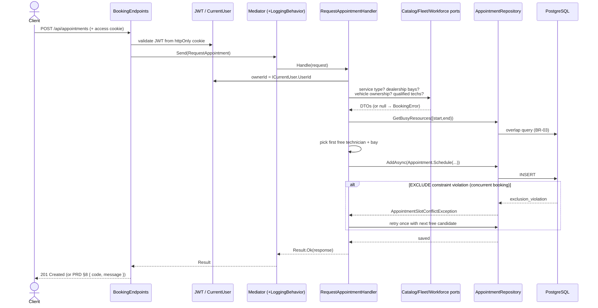

# System Design — Vehicle Service Scheduler

A backend .NET service for scheduling vehicle service appointments across dealerships, technicians,
and service bays. It is a **modular monolith** built with **Clean Architecture** and **vertical-slice
CQRS**, deployed as a single process but internally partitioned into feature modules that are
designed to be extracted into independent services without a rewrite. There is no frontend — the API
is the product, and the OpenAPI document at `/openapi/v1.json` is the client contract.

This is the **single source of truth** for the system design. It covers the context, the guiding
principle, the architecture and its trade-offs, each component's role, the request/data flow, the
concurrency strategy, technology choices and their justifications, cross-cutting concerns, the
observability strategy, the testing strategy, the extension path, and how generative AI was used
during design. It **complements the [ADRs](../docs/adrs/)** (which record the atomic *decisions*) and
the [product PRD](../docs/prds/appointment-booking.md) (which records the product *surface*) by
describing the *system as built*.

> **Companion diagram:** [`architecture/high-level.png`](architecture/high-level.png)
> (source: [`architecture/high-level.excalidraw`](architecture/high-level.excalidraw)).

---

## 1. Context

Dealership staff book vehicle service appointments manually — by phone, spreadsheet, or whiteboard —
checking bay and technician availability by hand. The process is slow, error-prone, and produces
double-bookings when two staff schedule against the same bay or technician for overlapping times.
Customers have no self-service way to request an appointment and get an immediate, reliable
confirmation.

This system is the backend for that flow. There is no frontend; the API is the product, and the
OpenAPI document at `/openapi/v1.json` is the client contract.

---

## 2. Guiding principle

> **Simple today, extendable tomorrow.**

Every architectural choice in this system is a version of that trade. Do the smallest thing that fits
the current scope; make sure it can grow without a rewrite. Whenever a "big" pattern (microservices,
event sourcing, saga orchestration) came up, the answer was: keep the *shape* of the seam that
pattern would need, defer the *machinery* until it's actually load-bearing.

---

## 3. Component roles

One deployable process, four feature modules, one PostgreSQL instance.


| Component | Project | Role |
|---|---|---|
| **Host / API** | `Host/AppointmentScheduler.Api` | The single deployable process. Owns `Program.cs`, composition root (`Add<Module>Module()`), security wiring, health checks, OpenAPI, and DB initialization. Endpoints are thin: bind → `ISender.Send(...)` → map result to HTTP. |
| **Booking module** | `Modules/Booking` | Core domain: the `Appointment` aggregate — a confirmed reservation of a bay + technician for a vehicle over a `TimeSlot`. Owns the booking workflow, availability logic, and the no-double-booking guarantee. The only module with its own `Api/` endpoints. |
| **Fleet module** | `Modules/Fleet` | Vehicles, dealerships, and service bays. Provides `IServiceBayLookup` (bays per dealership) and `IVehicleOwnershipQuery` (does this caller own this vehicle?). |
| **Workforce module** | `Modules/Workforce` | Technicians and their skill qualifications. Provides `IQualifiedTechnicianLookup` (technicians qualified for a service type at a dealership). |
| **Catalog module** | `Modules/Catalog` | Service types and their fixed durations. Provides `IServiceTypeLookup` — the authoritative source of appointment duration (BR-07). |
| **`*.Contracts`** | per module | Each module's public surface for other modules: cross-module query ports + DTOs (and, later, published events). Consumers depend on this, never on the implementation. |
| **BuildingBlocks.SharedKernel** | `BuildingBlocks/…SharedKernel` | Tactical-DDD primitives: `Entity<TId>` (identity equality), `IAggregateRoot` / `IValueObject` markers, and `Guard` argument helpers. No framework dependencies. |
| **BuildingBlocks (Messaging)** | `BuildingBlocks/…BuildingBlocks` | The lightweight in-process **mediator** (`ISender`, `IRequestHandler<,>`, `IPipelineBehavior<,>`) and cross-cutting ports (`ICurrentUser`). No MediatR. |
| **BuildingBlocks.Persistence** | `BuildingBlocks/…Persistence` | The single shared `AppDbContext` (also the Identity store), ASP.NET Core Identity, refresh-token storage/rotation, and all EF Core migrations. Persistence itself owns the Identity tables and `refresh_tokens`, which the context exposes directly (e.g. `DbSet<RefreshToken>`). |
| **PostgreSQL** | — | System of record. One schema per module (`booking` / `fleet` / `workforce` / `catalog`) plus Identity tables in the default `public` schema. Enforces the no-overlap invariant with `EXCLUDE` constraints. |

---

## 4. Architecture: the trade-offs

Read the [ADRs](../docs/adrs/) before designing anything that crosses a module boundary — they record
the decisions this section summarises.

### 4.1 Modular monolith over microservices

Microservices would have been the fashionable choice. But they charge the full distributed-systems
tax — network hops, separate deploys, cross-service data consistency, distributed tracing overhead —
before this system needs any of it. A plain monolith, on the other hand, is cheap today and painful
later, when one area silently breaks another.

I picked the middle: a **modular monolith**. One deployable process to run, test, debug, and observe,
but with real internal boundaries so any module can be lifted into its own service later without a
rewrite.

**Alternatives considered and rejected:**

| Option | Why not |
|---|---|
| Microservices from day one | Premature distributed-systems tax; unclear service boundaries this early. |
| Unstructured monolith | Boundary erosion is silent; refactoring cost compounds. |
| Modular monolith **without** compiler-enforced boundaries | Convention-only isolation fails under time pressure. |

Recorded in [ADR-0001](../docs/adrs/0001-modular-monolith.md); the physical structure that makes it
hold is [ADR-0006](../docs/adrs/0006-project-per-module-physical-structure.md).

### 4.2 CQRS: only the first level

Full CQRS — separate read and write databases, projections, event sourcing — is a lot of machinery
for a system this size. I kept just the first level: **read handlers and write handlers are separated
in code, sharing one database**. Same principle as the architecture: simple today, but if we ever
want a dedicated read store, materialized views, or projections, the seam is already there.

### 4.3 Module boundaries

Splitting the code into a `Modules/Booking/` folder does not, on its own, prevent a Booking
repository from reaching into another module's tables. The boundary has to be structural, not just
organizational.

The rule I set: **a module can see the shared `BuildingBlocks` and other modules' `Contracts`
projects — and nothing else**. Booking can call `IServiceBayLookup`, a port declared in
`Fleet.Contracts`, but it cannot touch a `ServiceBay` entity or a Fleet EF configuration. Cross-module
reads go through query ports; cross-module writes are designed to travel as domain events (ADR-0002).
This is enforced two ways: the `ProjectReference` graph makes a cross-module type reference a
**compile error**, and a **NetArchTest** suite is the runtime backstop.

See [ADR-0006](../docs/adrs/0006-project-per-module-physical-structure.md) for the physical structure
that makes this hold.

---

## 5. Data flow

### Request pipeline (write path — "book an appointment")



Step by step:

1. **Transport & auth.** The client calls `POST /api/appointments` with the access token riding
   **primarily in an `httpOnly` cookie** (never JS-readable). `JwtBearerEvents.OnMessageReceived`
   lifts the token from the cookie first, and falls back to the `Authorization: Bearer` header if
   the cookie is absent (useful for service-to-service and probe traffic). The token is
   HS256-validated with a pinned `ValidAlgorithms` list plus issuer, audience, lifetime, and signing
   key.
2. **Endpoint.** `BookingEndpoints` binds the request body directly to the Application request record
   (`RequestAppointment` — *no* owner field) and calls `ISender.Send(...)`. Endpoints contain no
   business logic.
3. **Mediator pipeline.** The mediator resolves the single handler and wraps it with `LoggingBehavior`,
   which times every request and logs success/failure with the elapsed milliseconds.
4. **Handler (vertical slice).** `RequestAppointmentHandler` takes the owner from `ICurrentUser`
   (server-side, never the body), then validates in PRD §10 order via the **cross-module query ports** —
   service type exists, start is in the future, dealership exists, caller owns the vehicle, qualified
   technicians exist. Each failure maps to a `BookingError` carrying a stable code + HTTP status.
5. **Availability.** It reads currently-busy bays/technicians for `[start, end)` using the shared
   half-open overlap predicate (BR-03), narrows to free candidates, and constructs the `Appointment`
   aggregate — whose factory re-enforces the invariants and derives the window as `[start, start + duration)`.
6. **Concurrency safety.** The insert can still race a concurrent booking. The database — not the
   application — is the arbiter: Postgres `EXCLUDE` constraints reject an overlapping bay/technician,
   surfacing as `AppointmentSlotConflictException`. The handler **retries at most once** with the
   next free candidate in the losing dimension; if that retry also loses (or no free candidate
   remains), the caller receives `409 slot_conflict` per PRD §8. Retry is **bounded to one** — not a
   loop — to prevent unbounded contention under load (ADR-0005 / PRD §10). Section 6 covers the
   invariant in detail.
7. **Response.** Success → `201 Created` with the appointment DTO. Failure → the `BookingError`'s
   `{ code, message }` at its HTTP status (the PRD §8 error contract).

### Cross-module reads

Booking never touches another module's tables or types. It calls a **query port owned by the
provider** (e.g. `IServiceBayLookup` in `Fleet.Contracts`), which the provider implements in its own
Infrastructure over the shared `AppDbContext`. This keeps module boundaries intact today and makes the
seam a network call away tomorrow. Cross-module **writes** are designed to travel as domain events
(ADR-0002) rather than direct calls — see *Roadmap* below.

### Persistence

All modules share one `AppDbContext` that references no module. Each *module* aggregate is mapped by
the owning module's `IEntityTypeConfiguration<>` into that module's Postgres schema, with snake_case
columns; access is via `Set<T>()`, so the context stays module-agnostic. Persistence itself owns the
ASP.NET Core Identity tables and the `refresh_tokens` table — those live directly on the context
(`DbSet<RefreshToken>` + `IdentityDbContext<AppUser>`) since they belong to the platform, not to any
feature module. Schema changes are owned by EF Core migrations; Development auto-migrates and seeds
on startup, production runs migrations as a deliberate deploy step.

---

## 6. The interesting problem: overlap prevention

Two clients requesting the same bay at the same second is a race the application code alone cannot
safely resolve. If both readers see "bay 3 is free" before either writes, application-level locking
either blocks every request (throughput hit) or leaks under load.

I moved the invariant into the database. `booking.appointments` has a **PostgreSQL `EXCLUDE USING
gist` constraint** on `(service_bay_id, tstzrange(start, end))` and another on `(technician_id,
tstzrange(start, end))`, filtered `WHERE status = 'Confirmed'` so future non-confirmed statuses (e.g.
cancelled) drop out of the constraint automatically. If two writes race, one succeeds and the other
fails with SQL state `23P01` (exclusion violation).

The handler catches that exception and **retries at most once** with the next free candidate in the
losing dimension. If the retry also loses (or there's no candidate left), the caller gets a `409` with
a stable `NO_BAY_AVAILABLE` / `NO_QUALIFIED_TECHNICIAN` code.

Why one retry, not a loop?
- One retry converts almost every real-world race into a success without extra client work.
- A loop reintroduces unbounded contention under load: many losers all retrying against the same
  shrinking free set.

Why the DB, not application locking?
- **Provably safe under concurrency, not probably safe.** The invariant is declarative and enforced
  regardless of how many API instances process overlapping requests.
- The constraint is schema, not code — it can't be forgotten or bypassed by a future feature.

Half-open intervals (`[start, end)`) mean back-to-back appointments — one ending at `T`, another
starting at `T` on the same resource — are not conflicts. That's an explicit business rule (BR-03),
pinned by dedicated tests.

Recorded in [ADR-0005](../docs/adrs/0005-postgresql-over-document-database.md). Test coverage in
`RequestAppointmentTests` (each case mapped to a numbered acceptance criterion so a failing test names
the rule it broke).

---

## 7. Technology choices & justifications

| Choice | Why | Reference |
|---|---|---|
| **.NET 10 / C# 14** | Modern LTS-track runtime; records, minimal APIs, and `TimeProvider` make the DDD + testable-time style concise. Common properties are centralized in `Directory.Build.props`, warnings-as-errors on. | — |
| **Modular monolith** (not microservices) | One deployable to operate, test, and debug, while still enforcing hard internal boundaries. Modules are extraction-ready, so we get microservice *design discipline* without the distributed-systems *tax* prematurely. | [ADR-0001](../docs/adrs/0001-modular-monolith.md) |
| **Project-per-module** | Boundaries become a **compile error**, not a convention — a module physically cannot reference another module's internals. Backed by NetArchTest as a runtime backstop. | [ADR-0006](../docs/adrs/0006-project-per-module-physical-structure.md) |
| **PostgreSQL** (over a document DB) | The core invariant is *no overlapping bookings for a bay/technician* — a multi-row, concurrent constraint. Postgres enforces it declaratively with `EXCLUDE … USING gist` (with `btree_gist`), which a document store cannot. Relational integrity + transactions fit the domain. | [ADR-0005](../docs/adrs/0005-postgresql-over-document-database.md) |
| **EF Core 10 + Npgsql** | Productive mapping with `IEntityTypeConfiguration` per aggregate, LINQ overlap queries that translate to SQL, and first-class migrations. Schema-per-module keeps ownership explicit. | — |
| **Vertical-slice CQRS + tiny in-process mediator** | Each feature is one self-contained request/handler file; the mediator adds cross-cutting behavior (logging, and later validation/metrics) without a heavyweight dependency. No MediatR keeps the surface small and licensing-free. | — |
| **FluentResults** | Business failures (`BookingError`) are values carrying a stable machine code + HTTP status — no exceptions for expected outcomes, and the endpoint needs no code→status mapping table. | — |
| **JWT in httpOnly cookies + ASP.NET Core Identity** | Cookie transport is XSS-safe (tokens unreadable by JS) and, with `SameSite=Strict`, CSRF-safe without a separate token. Short-lived access token (15 min default) + rotating, reuse-detecting refresh token (**configured TTL, defaulting to 7 days from original login — not reset on rotation**). Identity gives a battle-tested user store, PBKDF2 hashing, RBAC, and lockout. | [authentication.md](../docs/authentication.md) |
| **OpenTelemetry** | Vendor-neutral traces, metrics, and logs over OTLP — swap the backend (Grafana LGTM, Jaeger, Prometheus, a SaaS) without code changes. Backend-agnosticism is not theoretical here: the local stack was swapped from the .NET Aspire dashboard to Grafana LGTM with **only a `docker-compose.yml` edit** — zero application code touched. | §8.2 |
| **xUnit + AwesomeAssertions + NetArchTest** | Unit tests for handlers, `WebApplicationFactory` integration tests over real HTTP, and architecture tests that make the design rules self-verifying. | [../tests](../tests) |

---

## 8. Cross-cutting concerns

### 8.1 Authentication

JWT access tokens (HS256, **15 min**) and opaque refresh tokens (SHA-256-hashed at rest, **fixed
7-day TTL — not reset on rotation**), both transported as **`httpOnly`, `Secure`, `SameSite=Strict`
cookies**. XSS-safe (unreadable by JS) and CSRF-safe without a separate token.

- **Rotating, reuse-detecting refresh.** Reusing an already-rotated refresh token → the entire chain
  is revoked and the caller gets a 401. Session hijack becomes single-use.
- **Fixed absolute TTL.** A session cannot live forever by being active. Sliding was considered and
  rejected.
- ASP.NET Core Identity as the user store — battle-tested password hashing (PBKDF2), lockout, RBAC.
- Endpoints opt in with `.RequireAuthorization()` or `.RequireAuthorization(p => p.RequireRole("admin"))`.

Full design: [`docs/authentication.md`](../docs/authentication.md).

### 8.2 Observability

Observability is wired in `Program.cs` and follows the three pillars, plus health probes.

**Tracing.** OpenTelemetry with ASP.NET Core, `HttpClient`, **EF Core**, and **Npgsql** instrumentation,
exported via **OTLP** (honours the standard `OTEL_EXPORTER_OTLP_*` env vars; endpoint defaults to
`localhost:4317`). Every inbound request becomes a root span; EF Core emits a child span per LINQ query
(with the rendered SQL on `db.query.text`, SemConv v1.29+); Npgsql adds driver-level command spans on
top — so a single trace shows the endpoint, each of the handler's SQL statements, and the connection/
command timing, all correlated end-to-end. Outbound HTTP (e.g. to a future extracted module) is
similarly traced. The resource is tagged with service name + assembly version.

**Metrics.** OpenTelemetry metrics from ASP.NET Core (request rate, duration, active requests),
`HttpClient`, the **.NET runtime** (GC pause, thread pool, allocations, working set), and **Npgsql**
(connection-pool count, connection create time, per-command duration histograms) — exported over the
same OTLP pipeline. RED-style service metrics + runtime saturation + database saturation, with no
bespoke instrumentation.

**Logging.** `ILogger` with **trace-context correlation**: `ActivityTrackingOptions.TraceId | SpanId`
stamps every log line with the active trace/span id, so logs join up with traces. Logs are **also
exported via OTLP** (`WithLogging`, sharing the same resource as traces/metrics), so a backend can show
a trace and its own log records together. In parallel, Development keeps the human-readable console and
other environments emit **structured JSON** (`AddJsonConsole`, scopes included) for log aggregators. The
mediator's `LoggingBehavior` logs every request name and its elapsed time (and exceptions with
duration) — one consistent place for per-request timing across all slices.

**Local viewing.** `docker-compose.yml` runs the **Grafana LGTM all-in-one** container
(`grafana/otel-lgtm` — Loki + Grafana + Tempo + Mimir + an OTel Collector) with OTLP receivers on
`localhost:4317` / `4318`, so `docker compose up -d` + running the API surfaces all three signals —
correlated — in Grafana at `http://localhost:3000` (default `admin/admin`). Datasources are
pre-provisioned; from the sidebar Explore is one click away for PromQL against Mimir, TraceQL against
Tempo, and LogQL against Loki. The `trace_id` derived-field wires log lines directly to their trace
view, and traces link back to logs via the same id. State (dashboards + backends' TSDB/log/trace
chunks) persists in the `observability-data` volume across container restarts.

A **Golden Signals dashboard** (`AppointmentScheduler.Api — Golden Signals`, uid
`app-golden-signals`) provides nine panels grouped in three rows: **RED** (request rate, 5xx error
rate stat with threshold colouring, p95 latency by route), **runtime saturation** (active requests,
GC pause rate, working set), and **database** (connection-pool depth vs. `max`, DB p95 query duration
by SQL operation, DB QPS by operation). All queries key on a `service` templating variable populated
from Prometheus so the dashboard scales to multiple services on the same OTLP endpoint.

### 8.3 Error handling

Business failures are **values** (`FluentResults`), not exceptions. Each failure carries a stable
machine code (`SERVICE_TYPE_NOT_FOUND`, `NO_BAY_AVAILABLE`, `APPOINTMENT_ALREADY_CANCELLED`, …) and its
HTTP status. The endpoint renders the code + message; no exception-to-status mapping table is needed.
Only truly exceptional situations (DB unreachable, unhandled bug) travel as exceptions to the
framework's problem-details middleware.

### 8.4 Health checks

Kubernetes-style split:
- `GET /health/live` — liveness, no dependency checks (is the process up?).
- `GET /health/ready` — readiness, pings the database via `AddDbContextCheck` (can we serve traffic?).
- `GET /health` — liveness alias for existing probes.

---

## 9. Data model

| Module | Aggregate / entity | Notes |
|---|---|---|
| Booking | `Appointment` (aggregate root) | Owner, vehicle, dealership, bay, technician, `[Start, End)`, `Status` (`Confirmed` / `Cancelled`). |
| Fleet | `Vehicle`, `Dealership`, `ServiceBay` | Vehicle carries `OwnerId` (link to Identity). |
| Workforce | `Technician`, `TechnicianQualification` | Qualification records which service types a technician may perform. |
| Catalog | `ServiceType` | Name + fixed `Duration` (source of appointment length). |

**Cross-module references are opaque IDs.** Booking's `Appointment` holds a `TechnicianId`, not a
`Technician` reference — no module `using`s another module's Domain type.

---

## 10. Testing strategy

Three test projects run in one `dotnet test` pass:

| Project | Kind | What it validates |
|---|---|---|
| `Application.Tests` | Handler unit tests (xUnit + AwesomeAssertions) | Every acceptance criterion / business rule in the PRD — the write flow's happy path, every validation error, availability shortages, half-open boundary, plus reschedule / cancel guards. Fakes for the four cross-module ports and the repository. |
| `Api.Tests` | Integration over `WebApplicationFactory` | The HTTP pipeline end-to-end — booking endpoint, real cookie/JWT auth (`AuthEndpointsTests`), profile, health. |
| `ArchitectureTests` | NetArchTest | Module boundaries + aggregate rules the compiler can't fully express. |

Test names carry the acceptance-criterion / business-rule id (`AT-08 / BR-01`) so a failing test names
the rule it broke.

---

## 11. Trade-offs — summary

| Decision | What I chose | What I gave up | Recorded in |
|---|---|---|---|
| Deployment shape | Modular monolith | Independent per-module deploys (for now) | [ADR-0001](../docs/adrs/0001-modular-monolith.md) |
| Physical isolation | Project per module + arch tests | A little more `.csproj` juggling | [ADR-0006](../docs/adrs/0006-project-per-module-physical-structure.md) |
| Persistence | Single PostgreSQL, schema per module | Polyglot persistence | [ADR-0005](../docs/adrs/0005-postgresql-over-document-database.md) |
| CQRS depth | First level only (in-code read/write split) | Event sourcing, dedicated read store | — |
| Concurrency | DB-enforced `EXCLUDE` + retry-once | Application-level locking | ADR-0005 |
| Cross-module comms | Read: query ports; write: events (deferred) | Direct calls (banned) | [ADR-0002](../docs/adrs/0002-events-for-inter-module-communication.md), [ADR-0004](../docs/adrs/0004-inter-service-communication-strategy.md) |
| Booking-as-source-of-truth | `Appointment` is the only calendar concept | Convenience columns like `Technician.LastReserved` | [ADR-0003](../docs/adrs/0003-appointment-as-scheduling-source-of-truth.md) |
| Auth transport | JWT in `httpOnly` cookies | Client-side token stores (XSS risk) | [`docs/authentication.md`](../docs/authentication.md) |
| Refresh lifetime | Fixed absolute TTL | Sliding indefinite sessions | Same |

---

## 12. Extension path

Because the boundary is real, each module is a candidate future service. Lifting Booking out is a
small, mechanical change:

1. Give it its own `AppDbContext` (only Booking's schema).
2. Deploy it as a new host.
3. Swap the in-process implementation of each cross-module `Contracts` port for a network client —
   HTTP for reads, message-bus subscriber for events.

The Booking handler code doesn't change. It never depended on `Fleet.Infrastructure`; it depended on
`Fleet.Contracts.IServiceBayLookup`. Same interface, different transport.

Nothing in today's design assumes co-location: `BuildingBlocks` are stateless, the mediator is
per-process by choice not necessity, and cross-module writes were designed from day one to travel as
domain events (the shape a message bus already takes).

**Honest trade:** the extraction path is a *plan*, not a *demonstration* — no module has actually been
lifted, so the seam hasn't been proven under load. But the patterns that would resist extraction
(shared types across modules, chained cross-module calls, ambient reads of another module's tables)
are exactly what the compiler and arch tests already forbid.

---

## 13. How generative AI assisted the design phase

GenAI (Claude) was used as a **design collaborator and reviewer**, with the human as the decision-maker
and automated checks as the objective backstop. The collaboration ran through a deliberate six-stage
pipeline:

> **ADR → PRD → Issues → Plan → Implement (TDD) → Review**

Each stage has a clear owner and a matching level of AI capability. Cheap, reversible steps happen
early. Expensive, hard-to-undo steps only happen after human sign-off on the ones before them.

### Stage 1 — ADR

I choose the ADR topic. The AI doesn't spot architectural decisions on its own; I do. When I decided
we needed a decision about "one shared `DbContext` vs one per module", I raised the ADR. Then I had
the AI help me write it up and stress-test both sides — surfacing the option space, trade-offs, and
consequences. The final call was mine.

### Stage 2 — PRD

I review every PRD very carefully before any code is written. A vague PRD produces bad code fast, and
bad code is expensive to un-do — so this is where I spend the most time. Reading end-to-end,
questioning assumptions, correcting scope. The AI drafts and iterates; only when I'm happy does the
pipeline move on.

### Stage 3 — Issues

The AI slices the approved PRD into thin, independently-shippable issues (tracer-bullet vertical
slices). This is routine cutting work, not judgment-heavy — the shape of the slices was already
decided upstream.

### Stage 4 — Plan

Each issue gets an implementation plan — files to touch, tests to write, migrations to add — that I
review with the same care as the PRD. Getting the plan right at this stage is much cheaper than
untangling code that was written to the wrong plan.

### Stage 5 — Implement (TDD)

Implementation is strictly TDD. The AI writes a failing test first, then just enough code to make it
pass, then refactors. Every commit is green. `dotnet build` (0 warnings) and the full test suite run
on every step.

### Stage 6 — Review

The AI reviews the resulting diff against the PRD, the plan, and the repo's coding standards —
surfacing duplicated logic, an unclassified domain type, or documentation that describes something
that isn't actually built. Findings feed directly back into the roadmap.

### Which model at which stage

The rule: where the decision is expensive to reverse or requires the broadest context, use the
strongest model. Where the work is mechanical, save the capacity.

| Stage | Recommended model |
|---|---|
| 1 — ADR | Strongest |
| 2 — PRD | Strongest |
| 3 — Issues | Weak or medium |
| 4 — Plan | Strongest |
| 5 — Implement (TDD) | Medium or strong |
| 6 — Review | Weak or medium (medium on complex slices) |

### Guardrails

AI output was treated as a **proposal, never authority**. Every change was gated by the compiler,
warnings-as-errors, the architecture tests, and the unit + integration test suites. ADRs preserve the
human reasoning so the "why" survives independent of the tool. Where docs and code diverged
(events/outbox), that gap is called out honestly rather than papered over.

---

## 14. Roadmap / known gaps

- **Events & outbox (ADR-0002) are designed but not yet implemented** — no `IEventPublisher` or
  outbox dispatcher exists in code today. Cross-module *writes* currently have no path; only cross-module
  *reads* (query ports) are live. This is the next major building block. Concrete motivating cases
  already visible: Fleet needs `AppointmentConfirmed` to update bay utilization and free-slot views;
  Workforce needs it to notify the assigned technician and reflect the assignment on their schedule;
  a future Notifications module needs it to email/SMS the customer. Today, none of those reactions
  have a channel — the only ways to add them would be a direct cross-module call (banned by the
  reference-graph rule) or the customer polling the API. That gap is what the outbox unblocks.
- Appointment **lifecycle** now covers `Confirmed` → `Cancelled` (soft cancel, one-way) plus
  reschedule (re-runs availability + retry-once on race, keeping identity). Still missing:
  `Completed` / `NoShow` terminal states, and a domain event on state transitions (blocked on the
  outbox above).

---

## 15. ADR index

| # | Decision |
|---|---|
| [0001](../docs/adrs/0001-modular-monolith.md) | Modular monolith over microservices |
| [0002](../docs/adrs/0002-events-for-inter-module-communication.md) | Events for inter-module communication (deferred implementation) |
| [0003](../docs/adrs/0003-appointment-as-scheduling-source-of-truth.md) | `Appointment` as the scheduling source of truth |
| [0004](../docs/adrs/0004-inter-service-communication-strategy.md) | Inter-service communication strategy |
| [0005](../docs/adrs/0005-postgresql-over-document-database.md) | PostgreSQL over a document database |
| [0006](../docs/adrs/0006-project-per-module-physical-structure.md) | Project-per-module physical structure |
| [0007](../docs/adrs/0007-shared-resource-scheduling-ownership.md) | Shared-resource scheduling ownership |

---

## Appendix — how to try it

```bash
# Start the stack (Postgres + Grafana LGTM observability)
docker compose up -d

# Run the API (auto-migrates + seeds in Development)
dotnet run --project src/Host/AppointmentScheduler.Api
# → http://localhost:5080 ; / redirects to /openapi/v1.json

# Full auth + booking smoke test
BASE=http://localhost:5080
curl -c cookies.txt -X POST "$BASE/api/auth/login" -H "Content-Type: application/json" \
  -d '{"email":"customer@example.com","password":"Passw0rd!$"}'
curl -b cookies.txt -X POST "$BASE/api/appointments" -H "Content-Type: application/json" \
  -d '{"vehicleId":"5b0a0000-0000-0000-0000-000000000001",
       "dealershipId":"0e1c0000-0000-0000-0000-000000000001",
       "serviceTypeId":"8f210000-0000-0000-0000-000000000001",
       "requestedStart":"2026-08-01T09:00:00Z"}'

# Observability dashboard: http://localhost:3000 (admin / admin)
# Tests: dotnet test -c Release
```

A Postman collection ([`ServiceScheduler Dev.postman_collection.json`](../ServiceScheduler%20Dev.postman_collection.json))
covers the booking, reschedule, cancel, validation, and race scenarios interactively.
