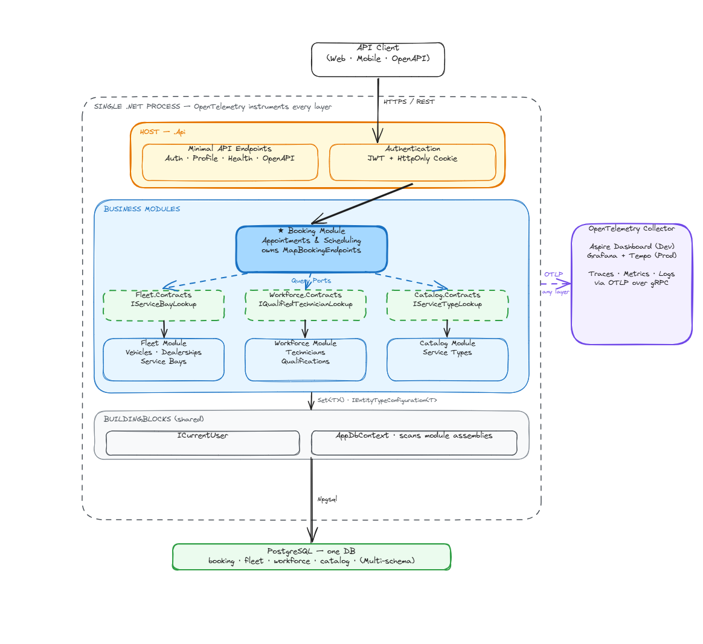
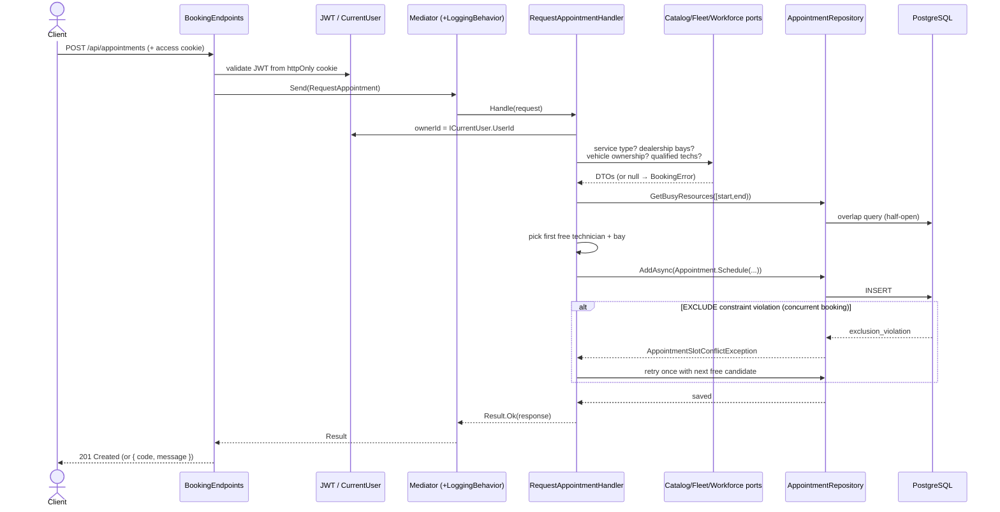

# System Design Document — Vehicle Service Scheduler

> **Audience:** interviewer / reviewer.
> **Reading time:** ~10 minutes.
> **Companion diagram:** [`high-level.png`](high-level.png) (source: [`high-level.excalidraw`](high-level.excalidraw)).
> **Companion docs:** the deeper build-time write-up lives in [`../DESIGN.md`](../DESIGN.md); every major decision has an [ADR](../../docs/adrs/); the product surface lives in [`../../docs/prds/appointment-booking.md`](../../docs/prds/appointment-booking.md).

---

## 1. Context

Dealership staff book vehicle service appointments manually — by phone, spreadsheet, or whiteboard — checking bay and technician availability by hand. The process is slow, error-prone, and produces double-bookings when two staff schedule against the same bay or technician for overlapping times. Customers have no self-service way to request an appointment and get an immediate, reliable confirmation.

This system is the backend for that flow. There is no frontend; the API is the product, and the OpenAPI document at `/openapi/v1.json` is the client contract.

---

## 2. Guiding principle

> **Simple today, extendable tomorrow.**

Every architectural choice in this system is a version of that trade. Do the smallest thing that fits the current scope; make sure it can grow without a rewrite. Whenever a "big" pattern (microservices, event sourcing, saga orchestration) came up, the answer was: keep the *shape* of the seam that pattern would need, defer the *machinery* until it's actually load-bearing.

---

## 3. System overview

One deployable process, four feature modules, one PostgreSQL instance.



| Component | Role |
|---|---|
| **Host / API** (`AppointmentScheduler.Api`) | The only executable. Owns `Program.cs`, endpoint groups, security wiring, health checks, OpenAPI, DB initialization. Endpoints are thin: bind → mediator → map result to HTTP. |
| **Booking module** | The core domain: the `Appointment` aggregate. Owns the booking workflow, availability logic, and the no-double-booking guarantee. The only module with domain endpoints. |
| **Fleet module** | Vehicles, dealerships, service bays. Exposes `IServiceBayLookup` and `IVehicleOwnershipQuery`. |
| **Workforce module** | Technicians and their qualifications. Exposes `IQualifiedTechnicianLookup`. |
| **Catalog module** | Service types and their fixed durations. Exposes `IServiceTypeLookup` — the authoritative source of appointment duration. |
| **BuildingBlocks (Messaging)** | Lightweight in-process mediator (`ISender`, `IRequestHandler<,>`, `IPipelineBehavior<,>`) — no MediatR — and cross-cutting ports (`ICurrentUser`). |
| **BuildingBlocks (Persistence)** | Shared `AppDbContext`, ASP.NET Core Identity, refresh-token storage, EF Core migrations. References no module. |
| **PostgreSQL** | System of record. Schema per module (`booking.*`, `fleet.*`, `workforce.*`, `catalog.*`), plus Identity tables in `public`. Enforces the no-overlap invariant with `EXCLUDE` constraints. |

---

## 4. Architecture: the trade-off

### 4.1 Modular monolith over microservices

Microservices would have been the fashionable choice. But they charge the full distributed-systems tax — network hops, separate deploys, cross-service data consistency, distributed tracing overhead — before this system needs any of it. A plain monolith, on the other hand, is cheap today and painful later, when one area silently breaks another.

I picked the middle: a **modular monolith**. One deployable process to run, test, debug, and observe, but with real internal boundaries so any module can be lifted into its own service later without a rewrite.

**Alternatives considered and rejected:**

| Option | Why not |
|---|---|
| Microservices from day one | Premature distributed-systems tax; unclear service boundaries this early. |
| Unstructured monolith | Boundary erosion is silent; refactoring cost compounds. |
| Modular monolith **without** compiler-enforced boundaries | Convention-only isolation fails under time pressure. |

Recorded in [ADR-0001](../../docs/adrs/0001-modular-monolith.md).

### 4.2 CQRS: only the first level

Full CQRS — separate read and write databases, projections, event sourcing — is a lot of machinery for a system this size. I kept just the first level: **read handlers and write handlers are separated in code, sharing one database**. Same principle as the architecture: simple today, but if we ever want a dedicated read store, materialized views, or projections, the seam is already there.

---

## 5. Module boundaries

Splitting the code into a `Modules/Booking/` folder does not, on its own, prevent a Booking repository from reaching into another module's tables. The boundary has to be structural, not just organizational.

The rule I set: **a module can see the shared `BuildingBlocks` and other modules' `Contracts` projects — and nothing else**. Booking can call `IServiceBayLookup`, a port declared in `Fleet.Contracts`, but it cannot touch a `ServiceBay` entity or a Fleet EF configuration. Cross-module reads go through query ports; cross-module writes are designed to travel as domain events.

See [ADR-0006](../../docs/adrs/0006-project-per-module-physical-structure.md) for the physical structure that makes this hold.

---

## 6. Request flow — the write path



Points worth calling out:

- **Owner id comes from the session (`ICurrentUser`), never the body.** The endpoint request record doesn't even have an owner field — you can't forget to enforce this.
- **Cross-module calls go through the `Contracts` ports only.** Booking doesn't know Fleet's types exist.
- **Availability + insert is a two-step read-then-write that races.** The application picks a candidate; the *database* is the arbiter of whether that candidate actually wins. See §7.
- **`BookingError`** is a value carrying both a stable machine code (`NO_BAY_AVAILABLE`, `VEHICLE_NOT_OWNED_BY_CALLER`, …) and its HTTP status. The endpoint needs no code→status mapping table. Business failures are values, not exceptions.

---

## 7. The interesting problem: overlap prevention

Two clients requesting the same bay at the same second is a race the application code alone cannot safely resolve. If both readers see "bay 3 is free" before either writes, application-level locking either blocks every request (throughput hit) or leaks under load.

I moved the invariant into the database. `booking.appointments` has a **PostgreSQL `EXCLUDE USING gist` constraint** on `(service_bay_id, tstzrange(start, end))` and another on `(technician_id, tstzrange(start, end))`, filtered `WHERE status = 'Confirmed'` so future non-confirmed statuses (e.g. cancelled) drop out of the constraint automatically. If two writes race, one succeeds and the other fails with SQL state `23P01` (exclusion violation).

The handler catches that exception and **retries at most once** with the next free candidate in the losing dimension. If the retry also loses (or there's no candidate left), the caller gets a `409` with a stable `NO_BAY_AVAILABLE` / `NO_QUALIFIED_TECHNICIAN` code.

Why one retry, not a loop?
- One retry converts almost every real-world race into a success without extra client work.
- A loop reintroduces unbounded contention under load: many losers all retrying against the same shrinking free set.

Why the DB, not application locking?
- **Provably safe under concurrency, not probably safe.** The invariant is declarative and enforced regardless of how many API instances process overlapping requests.
- The constraint is schema, not code — it can't be forgotten or bypassed by a future feature.

Half-open intervals (`[start, end)`) mean back-to-back appointments — one ending at `T`, another starting at `T` on the same resource — are not conflicts. That's an explicit business rule (BR-03), pinned by dedicated tests.

Recorded in [ADR-0005](../../docs/adrs/0005-postgresql-over-document-database.md). Test coverage in `RequestAppointmentTests` (17 cases, each mapped to a numbered acceptance criterion so a failing test names the rule it broke).

---

## 8. Cross-cutting concerns

### 8.1 Authentication

JWT access tokens (HS256, **15 min**) and opaque refresh tokens (SHA-256-hashed at rest, **fixed 7-day TTL — not reset on rotation**), both transported as **`httpOnly`, `Secure`, `SameSite=Strict` cookies**. XSS-safe (unreadable by JS) and CSRF-safe without a separate token.

- **Rotating, reuse-detecting refresh.** Reusing an already-rotated refresh token → the entire chain is revoked and the caller gets a 401. Session hijack becomes single-use.
- **Fixed absolute TTL.** A session cannot live forever by being active. Sliding was considered and rejected.
- ASP.NET Core Identity as the user store — battle-tested password hashing (PBKDF2), lockout, RBAC.
- Endpoints opt in with `.RequireAuthorization()` or `.RequireAuthorization(p => p.RequireRole("admin"))`.

Full design: [`docs/authentication.md`](../../docs/authentication.md).

### 8.2 Observability

OpenTelemetry, three signals, one OTLP pipeline.

- **Traces** — ASP.NET Core, `HttpClient`, EF Core, and Npgsql instrumented; every inbound request becomes a root span, EF emits a child span per LINQ query with the rendered SQL, Npgsql adds command-level spans. A single trace shows endpoint + each SQL + connection timing, correlated end-to-end.
- **Metrics** — request rate / duration / active count, .NET runtime (GC pause, thread pool, allocations, working set), Npgsql (connection-pool depth, per-command duration). RED-style service metrics + runtime + database saturation, no bespoke instrumentation.
- **Logs** — `ILogger` with `TraceId | SpanId` stamped on every line, structured JSON in non-Development, exported over the same OTLP pipeline so a backend can show a trace and its own log records together.

Local viewing: `docker compose up -d` runs the **Grafana LGTM** all-in-one (Loki + Grafana + Tempo + Mimir + OTel Collector) with pre-provisioned datasources and a **Golden Signals dashboard** committed to git (dashboard-as-code) — reproducible on every machine.

Health probes split Kubernetes-style: `/health/live` (process up?), `/health/ready` (can we serve? pings the DB), `/health` (alias).

### 8.3 Error handling

Business failures are **values** (`FluentResults`), not exceptions. Each failure carries a stable machine code (`SERVICE_TYPE_NOT_FOUND`, `NO_BAY_AVAILABLE`, `APPOINTMENT_ALREADY_CANCELLED`, …) and its HTTP status. The endpoint renders the code + message; no exception-to-status mapping table is needed. Only truly exceptional situations (DB unreachable, unhandled bug) travel as exceptions to the framework's problem-details middleware.

---

## 9. Data model

| Module | Aggregate / entity | Notes |
|---|---|---|
| Booking | `Appointment` (aggregate root) | Owner, vehicle, dealership, bay, technician, `[Start, End)`, `Status` (`Confirmed` / `Cancelled`). |
| Fleet | `Vehicle`, `Dealership`, `ServiceBay` | Vehicle carries `OwnerId` (link to Identity). |
| Workforce | `Technician`, `TechnicianQualification` | Qualification records which service types a technician may perform. |
| Catalog | `ServiceType` | Name + fixed `Duration` (source of appointment length). |

**Cross-module references are opaque IDs.** Booking's `Appointment` holds a `TechnicianId`, not a `Technician` reference — no module `using`s another module's Domain type.

---

## 10. Trade-offs — summary

| Decision | What I chose | What I gave up | Recorded in |
|---|---|---|---|
| Deployment shape | Modular monolith | Independent per-module deploys (for now) | [ADR-0001](../../docs/adrs/0001-modular-monolith.md) |
| Physical isolation | Project per module + arch tests | A little more `.csproj` juggling | [ADR-0006](../../docs/adrs/0006-project-per-module-physical-structure.md) |
| Persistence | Single PostgreSQL, schema per module | Polyglot persistence | [ADR-0005](../../docs/adrs/0005-postgresql-over-document-database.md) |
| CQRS depth | First level only (in-code read/write split) | Event sourcing, dedicated read store | — |
| Concurrency | DB-enforced `EXCLUDE` + retry-once | Application-level locking | ADR-0005 |
| Cross-module comms | Read: query ports; write: events (deferred) | Direct calls (banned) | [ADR-0002](../../docs/adrs/0002-events-for-inter-module-communication.md), [ADR-0004](../../docs/adrs/0004-inter-service-communication-strategy.md) |
| Booking-as-source-of-truth | `Appointment` is the only calendar concept | Convenience columns like `Technician.LastReserved` | [ADR-0003](../../docs/adrs/0003-appointment-as-scheduling-source-of-truth.md) |
| Auth transport | JWT in `httpOnly` cookies | Client-side token stores (XSS risk) | [`docs/authentication.md`](../../docs/authentication.md) |
| Refresh lifetime | Fixed absolute TTL | Sliding indefinite sessions | Same |

---

## 11. Extension path

Because the boundary is real, each module is a candidate future service. Lifting Booking out is a small, mechanical change:

1. Give it its own `AppDbContext` (only Booking's schema).
2. Deploy it as a new host.
3. Swap the in-process implementation of each cross-module `Contracts` port for a network client — HTTP for reads, message-bus subscriber for events.

The Booking handler code doesn't change. It never depended on `Fleet.Infrastructure`; it depended on `Fleet.Contracts.IServiceBayLookup`. Same interface, different transport.

Nothing in today's design assumes co-location: `BuildingBlocks` are stateless, the mediator is per-process by choice not necessity, and cross-module writes were designed from day one to travel as domain events (the shape a message bus already takes).

**Honest trade:** the extraction path is a *plan*, not a *demonstration* — no module has actually been lifted, so the seam hasn't been proven under load. But the patterns that would resist extraction (shared types across modules, chained cross-module calls, ambient reads of another module's tables) are exactly what the compiler and arch tests already forbid.

---

## 12. Testing strategy

Three test projects run in one `dotnet test` pass:

| Project | Kind | What it validates |
|---|---|---|
| `Application.Tests` | Handler unit tests (xUnit + AwesomeAssertions) | Every acceptance criterion / business rule in the PRD — the write flow's happy path, every validation error, availability shortages, half-open boundary, plus reschedule / cancel guards. Fakes for the four cross-module ports and the repository. |
| `Api.Tests` | Integration over `WebApplicationFactory` | The HTTP pipeline end-to-end — booking endpoint, real cookie/JWT auth (`AuthEndpointsTests`), profile, health. |
| `ArchitectureTests` | NetArchTest | Module boundaries + aggregate rules the compiler can't fully express. |

Test names carry the acceptance-criterion / business-rule id (`AT-08 / BR-01`) so a failing test names the rule it broke.

---

## 13. ADR index

| # | Decision |
|---|---|
| [0001](../../docs/adrs/0001-modular-monolith.md) | Modular monolith over microservices |
| [0002](../../docs/adrs/0002-events-for-inter-module-communication.md) | Events for inter-module communication (deferred implementation) |
| [0003](../../docs/adrs/0003-appointment-as-scheduling-source-of-truth.md) | `Appointment` as the scheduling source of truth |
| [0004](../../docs/adrs/0004-inter-service-communication-strategy.md) | Inter-service communication strategy |
| [0005](../../docs/adrs/0005-postgresql-over-document-database.md) | PostgreSQL over a document database |
| [0006](../../docs/adrs/0006-project-per-module-physical-structure.md) | Project-per-module physical structure |
| [0007](../../docs/adrs/0007-shared-resource-scheduling-ownership.md) | Shared-resource scheduling ownership |

---

## Appendix — how to try it

```bash
# Start the stack (Postgres + Grafana LGTM observability)
docker compose up -d

# Run the API (auto-migrates + seeds in Development)
dotnet run --project src/Host/AppointmentScheduler.Api
# → http://localhost:5080 ; / redirects to /openapi/v1.json

# Full auth + booking smoke test
BASE=http://localhost:5080
curl -c cookies.txt -X POST "$BASE/api/auth/login" -H "Content-Type: application/json" \
  -d '{"email":"customer@example.com","password":"Passw0rd!$"}'
curl -b cookies.txt -X POST "$BASE/api/appointments" -H "Content-Type: application/json" \
  -d '{"vehicleId":"5b0a0000-0000-0000-0000-000000000001",
       "dealershipId":"0e1c0000-0000-0000-0000-000000000001",
       "serviceTypeId":"8f210000-0000-0000-0000-000000000001",
       "requestedStart":"2026-08-01T09:00:00Z"}'

# Observability dashboard: http://localhost:3000 (admin / admin)
# Tests: dotnet test -c Release
```

A Postman collection ([`ServiceScheduler Dev.postman_collection.json`](../../ServiceScheduler%20Dev.postman_collection.json)) covers the booking, reschedule, cancel, validation, and race scenarios interactively.
